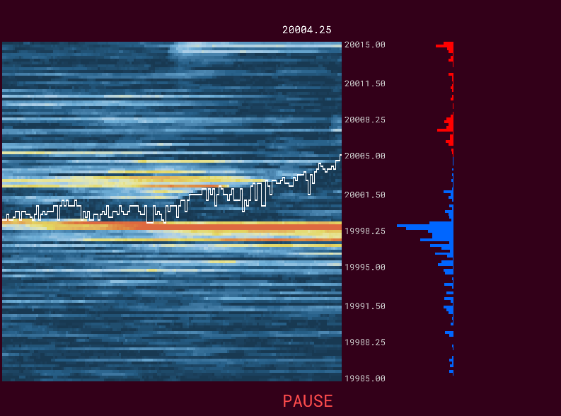

# BookMap-mk1

BookMap-mk1 is a C++ project designed for Windows, built and developed with Visual Studio (MSVC).  
It uses OpenGL, GLFW, FreeType, and other libraries for graphics and font rendering.

---

## 📸 Preview

<p align="center">
  
</p>

<!--
To show a short video demo:
- GIFs are supported in README.md on GitHub!  
- You can embed a GIF like this:
  
- Tip: Keep GIFs short and under 10MB for fast loading.
-->

## Overview

Order Book Heatmap Visualizer is a real-time OpenGL-based visualizer for market microstructure and order flow.  
It displays an interactive heatmap of the order book, complete with a price axis and a DOM (Depth Of Market) histogram.

**Note:**  
This is my very first C++ project and is still a work in progress.  
I am learning C++ and modern OpenGL as I build this tool, so expect active development and frequent improvements!

## Features

- Real-time rendering of order book heatmaps using OpenGL
- Dynamic and customizable price (Y) axis
- DOM histogram visualization
- Real-time updates and simulation pause/resume
- Modern user interface with ImGui (FPS display, parameter controls, overlays)
- Responsive layout adapting to window size

## Planned Features

- Live data feed support (currently uses simulated data)
- Improved color mapping and heatmap customization
- Save/export heatmap images
- More advanced UI options and statistics
- Performance optimizations and code refactoring

## 🚀 Quick Start

### Prerequisites

- **Windows 10 or later**  
- **Visual Studio 2019/2022** (with "Desktop development with C++" workload)
- **CMake** (version 3.14 or higher)
- All required third-party libraries (GLFW, FreeType, etc.) are provided in `lib/msvc/`
- No MinGW/GCC support: This project is for MSVC only.

-----

### Building the Project

1. **Clone the repository**
   ```sh
   git clone https://github.com/your-username/BookMap-mk1.git
   cd BookMap-mk1
   ```

2. **Create a build directory and generate the Visual Studio solution**
   ```sh
   mkdir build
   cd build
   cmake -G "Visual Studio 17 2022" ..
   ```

3. **Open the solution in Visual Studio**
   - Open `build/BookMap-mk1.sln`
   - Select `Debug` or `Release` configuration
   - Build the project (`Build > Build Solution` or press `Ctrl+Shift+B`)

4. **Run the program**
   - The executable will be in `build/bin/`
   - All required `.dll` files are copied automatically


## ❗ Notes and Limitations

- **Windows/MSVC only**:  
  This project is intended for Visual Studio (MSVC) on Windows.  
  There is currently no support for MinGW or Linux/Mac compilation out-of-the-box.
- **Binaries**:  
  Prebuilt dependencies in `lib/msvc/` are for your convenience.  
  If you wish to port the project to another platform or compiler, you must obtain or build compatible binaries yourself.
- **Redistributable**:  
  The project uses the Universal CRT; users may need the Microsoft Visual C++ Redistributable (2015-2022).

---

## 📦 License

See [LICENSE](LICENSE.txt) for license information.

---
